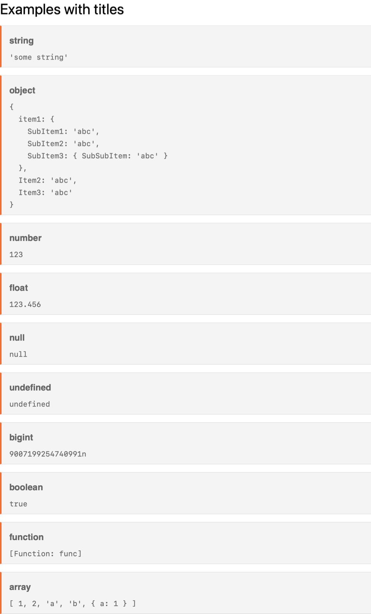
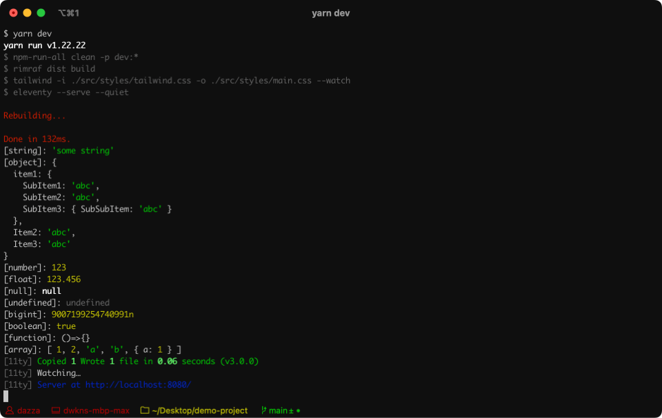
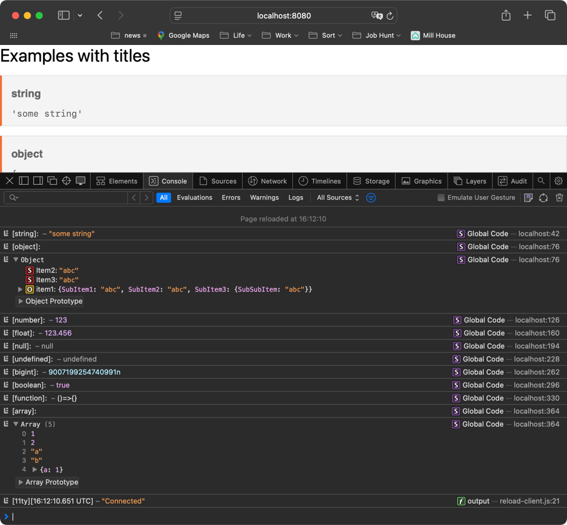

# eleventy-plugin-console-plus

Console Plus is an Eleventy (v3.x) shortcode that Pretty Prints the contents of variables and objects in your tempate, your browser console or your teminal. Think of it like [Eleventy's Log Filter](https://www.11ty.dev/docs/filters/log/) on steroids. It's super useful for debugging 11ty projects. Strings, Arrays and multi-level Objects are all supported.

You can output to just the terminal, just the browser console, just your template or any combination of these. There are options to control :
 - The depth that objects print 
 - Whether you colourize the output (where supported). 
 - How many columns to print before wrapping
 
## Installing

### npm
```bash
$ npm install eleventy-plugin-console-plus
```

### Yarn
```bash
$ yarn add eleventy-plugin-console-plus
```

### Add to your config. Usually `.eleventy.js`
```js
 import logToConsole from 'eleventy-plugin-console-plus'

export default async  (eleventyConfig)=> {
  // default options shown
  options = {
    logToHtml: true, // log to HTML
    logToTerminal: true, // log to terminal
    colorizeConsole: true, // colorize the console output
    escapeHTML: true, // escape HTML in the output
    depth: 4 // depth of object to print
    breakLength: 60 // length of line to break
	}
  eleventyConfig.addPlugin(logToConsole, options);
}
```

### Usage
```

```
#### Example
Printing out various JS variable types with titles.

 In your template 
```html
  <p class="text-3xl">Examples with titles</p>
    
     
     
     
     
     
     
     
     
     
...
```

*html output showing some example variables*


*Terminal output of the same the example variables*


*Browser console output showing the example variables*

### Updates
0.1.0 (latest) — Added logging to browser console & option to wrap line length.

### 11ty CommonJS support
The latest version of this plugin is for ES6 Eleventy (v3) Config files. If you need to use a CommonJS Eleventy Config file then you can use [version 0.0.3](https://www.npmjs.com/package/eleventy-plugin-console-plus/v/0.0.3) instead. It is functional but doesn't have all the features of the latest version. 