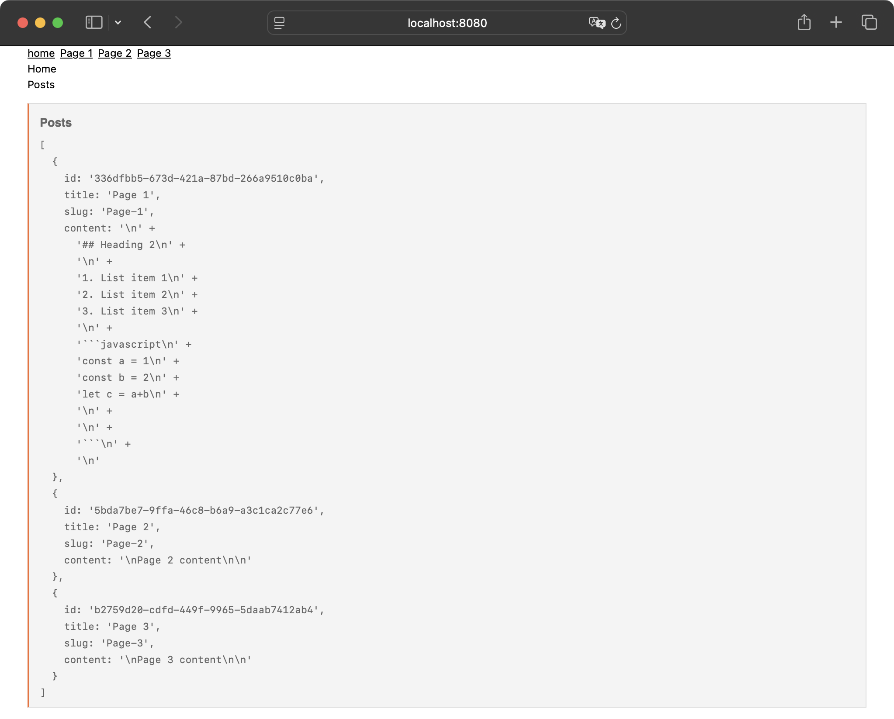
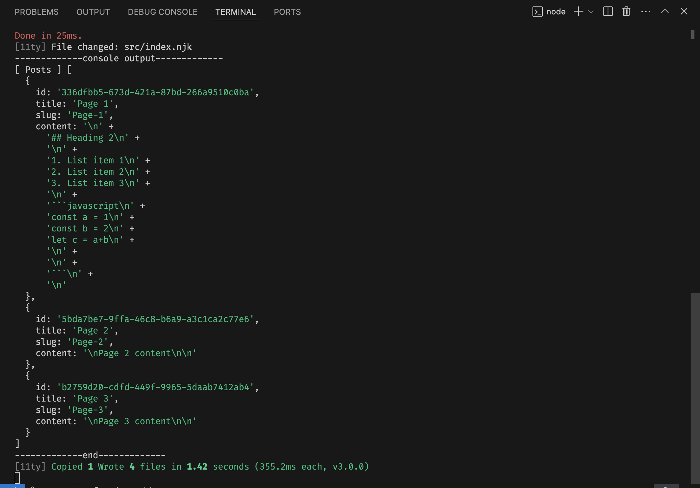

# eleventy-plugin-console-plus

Console Plus is an Eleventy (v3.x) shortcode that Pretty Prints the contents of variables and objects in your HTML or your teminal. Think of it like [Eleventy's Log Filter](https://www.11ty.dev/docs/filters/log/) on steroids. It's super useful for debugging 11ty projects. Strings, Arrays and multi-level Objects are all supported.

You can output to just the terminal, just your template or both. You can also choose the depth that objects print to and whether you colourize the output. 
 
## Installing

### npm
```bash
$ npm install eleventy-plugin-console-plus
```

### Yarn
```bash
$ yarn add eleventy-plugin-console-plus
```

### Add to your config. Usually `.eleventy.js`
```js
 import logToConsole from 'eleventy-plugin-console-plus'

export default async  (eleventyConfig)=> {
  // default options shown
  options = {
    logToHtml: true, // log to HTML
    logToTerminal: true, // log to terminal
    colorizeConsole: true, // colorize the console output
    escapeHTML: true, // escape HTML in the output
    depth: 4 // depth of object to print
	}
  eleventyConfig.addPlugin(logToConsole, options);
}
```

### Usage
```

```
#### Example
Printing out a `posts` object with a title.

 In your template such as `posts.njk` 
```html
<h1>Home</h1>
<h2>Posts</h2>


...
```

*html output showing the contents of a `posts` object*


*Terminal output of the same `posts` object*


### 11ty CommonJS support
The latest version of this plugin is for ES6 Eleventy (v3) Config files. If you need to use a CommonJS Eleventy Config file then you can use [version 0.0.3](https://www.npmjs.com/package/eleventy-plugin-console-plus/v/0.0.3) instead. It's functionally identical but written in CommonJS. 