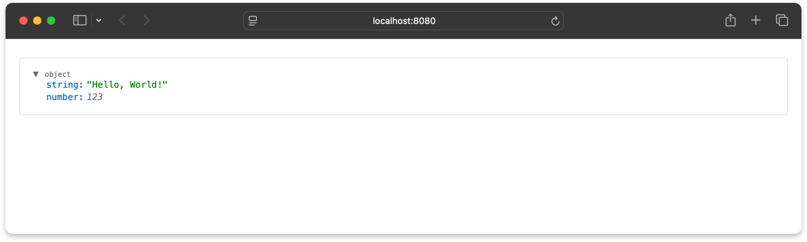
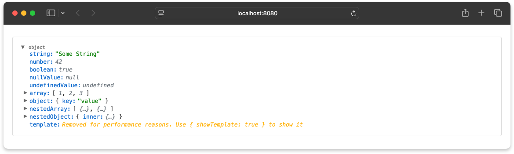
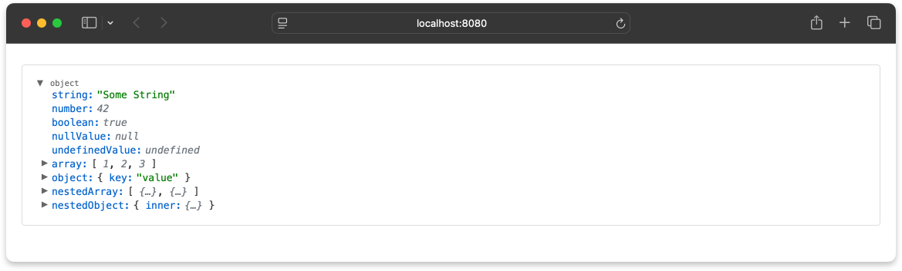
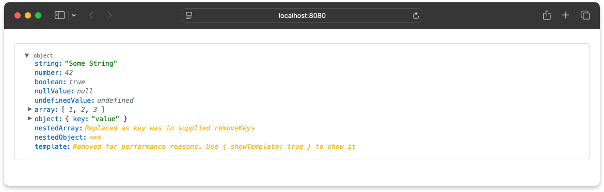
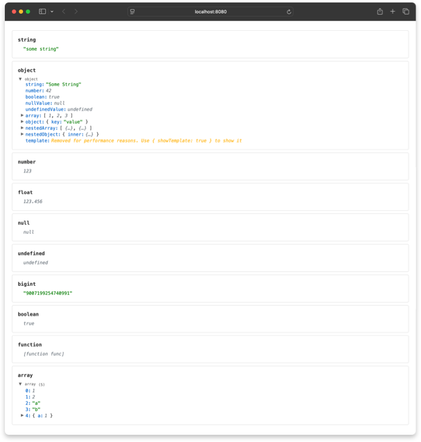
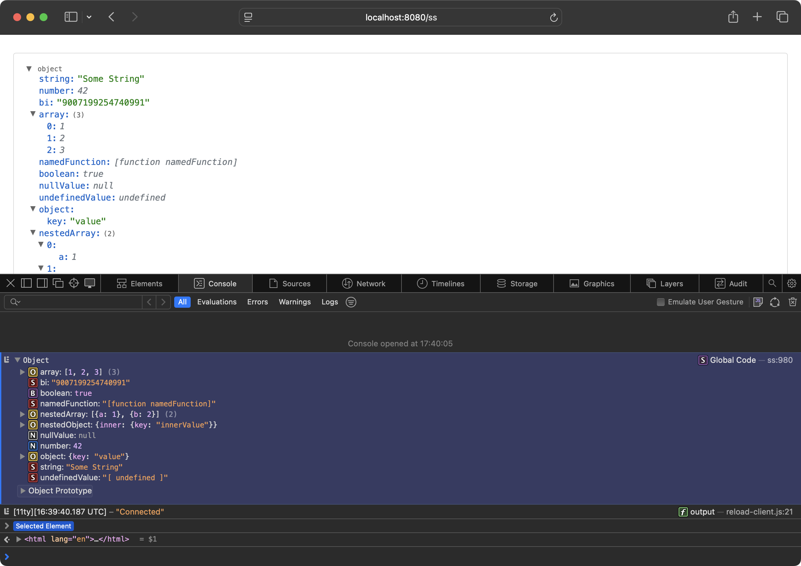
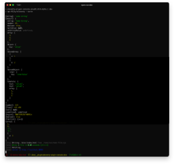

# eleventy-plugin-console-plus

**Console Plus** is a Eleventy (11ty) plugin that adds a shortcode for debugging your templates, objects, and data. It logs to your HTML output, your terminal, and your browser console—all at once, with beautiful formatting and deep customization.

The HTML output uses a custom **Web Component** (`<console-plus>`) that provides an interactive, collapsible JSON viewer with advanced features like type labels, hover paths, and expandable nodes.

If you've ever tried to debug collections or any other complex object in Eleventy this is for you. 

---

## ✨ Features

- **Interactive Web Component**: Uses `<json-viewer>` custom element for rich HTML output
- **Multi-destination logging**: Outputs to HTML, terminal, and browser console simultaneously
- **Advanced JSON viewer**: Collapsible nodes, type labels, key paths on hover, and expand controls
- **Robust data handling**: Handles circular references, functions, symbols, BigInts, Dates, and undefined
- **Security features**: XSS prevention, input validation, and malicious content detection
- **Performance optimized**: Memoization, debouncing, and memory management
- **Browser compatibility**: Fallback modes for environments without Shadow DOM support
- **Flexible configuration**: Hide or replace keys, control output destinations, and customize viewer appearance
- **Works with Eleventy v3+**: Full ESM & CJS support

---

## 🚀 Installation

```bash
npm install eleventy-plugin-console-plus
```

---

## ⚡ Quick Start

In your `eleventy.config.js` :

#### ES Modules Configuration

```js
import { consolePlus } from 'eleventy-plugin-console-plus';

export default function(eleventyConfig) {
  eleventyConfig.addPlugin(consolePlus);
}
```

#### CommonJS Configuration

Since this plugin is an ES module, you'll need to use dynamic `import()` in CommonJS configuration files:

```js
module.exports = async function(eleventyConfig) {
  const { consolePlus } = await import('eleventy-plugin-console-plus');
  eleventyConfig.addPlugin(consolePlus);
};
```


In your template:

```njk
  
```

Outputs to your HTML as an interactive web component:



### Collections Example

Debug your Eleventy collections data:

```njk
  
```

This will display all your content organized by collection in the interactive JSON viewer.

---

## 🛠️ Usage

An object, string, variable or array is required as the first argument. A title and configurantion options are optional.

```

```

## Examples

Assume we have the following variable:

```js
 obj = {
        string: "Some String",
        number: 42,
        boolean: true,
        nullValue: null,
        undefinedValue: undefined,
        array: [1, 2, 3],
        object: { key: "value" },
        nestedArray: [{ a: 1 }, { b: 2 }],
        nestedObject: { inner: { key: "innerValue" } },
        template: { key1: "value1", key2: "value2", array: [1, 2, 3] }
 		}
```

### 1. **With a Title**

```njk

```



### 4. **Show Types and Default Expanded**

```njk

```

This will display type labels and expand all nodes by default in the web component viewer.

### 2. **Showing Template Keys**

By default any key named `template` has it's value removed for performance reasons. Eleventy puts a TON of stuff in the `template` key of your page and in collections. You almost never need it. But if you do...
```njk

```



### 3. **Hiding or replacing keys**

Similarly sometimes your data contains a large nested structure that you're not interested in. You can exclude or replace this in the output with...

```njk

```



## 🔧 Web Component Features

The `<console-plus>` web component provides several interactive features:

- **Collapsible nodes**: Click the arrow (▶/▼) to expand/collapse objects and arrays
- **Type labels**: Enable `showTypes: true` to see data type indicators
- **Hover paths**: Enable `pathsOnHover: true` to see key paths when hovering
- **Default expansion**: Use `defaultExpanded: true` to show all content expanded
- **Visual controls**: Enable `showControls: true` for additional UI controls
- **Custom styling**: Adjust `indentWidth` for spacing preferences

### Browser Compatibility

The web component includes fallback support for environments without Shadow DOM:

- **Modern browsers**: Uses Shadow DOM for encapsulation
- **Legacy browsers**: Falls back to direct DOM manipulation
- **No JavaScript**: Displays as plain text if JavaScript is disabled

## ⚙️ Configuration

You can pass a configuration object when you add the plugin. 

In your `eleventy.config.js`:

```js
import { consolePlus } from 'eleventy-plugin-console-plus';

export default function(eleventyConfig) {
  eleventyConfig.addPlugin(consolePlus, { 
  	logToHtml: true,  				 // output to HTML
  	logToTerminal: false, 		 // output to terminal
  	logToBrowserConsole: false,// output to browser console
  	showTemplate: true         // always show template key
  } );
}
```
These options will apply to all instances of the shortcode. Unless you overide them on a case by case basis.

```html
	
```
`template` will not be shown and output will be logged to terminal  in this instance of the shortcode. 

You can see the full configurations options below. 

---

## ⚙️ Options Reference

| Option              | Type      | Default   | Description |
|---------------------|-----------|-----------|-------------|
| logToHtml           | boolean   | true      | Output to HTML viewer |
| logToTerminal       | boolean   | true      | Output to terminal |
| logToBrowserConsole | boolean   | true      | Output to browser console |
| title               | string    | ""        | Optional title for output |
| colorizeConsole     | boolean   | true      | Colorize terminal output |
| depth               | number    | 8         | Terminal object depth |
| breakLength         | number    | 60        | Terminal line break length |
| showTemplate        | boolean   | false     | Show 'template' keys in objects |
| maxCircularDepth    | number    | 1         | Max depth for circular references |
| removeKeys          | array     | []        | Keys to remove/replace (string or {keyName, replaceString}) |
| showTypes           | boolean   | false     | Show type labels in viewer |
| defaultExpanded     | boolean   | false     | Expand nodes by default in viewer |
| pathsOnHover        | boolean   | false     | Show key path hover panel in viewer |
| showControls        | boolean   | false     | Show UI controls in viewer |
| indentWidth         | number    | 6         | Indentation width in px in viewer |

---

## 🖼️ Screenshots

HTML output



Browser Console output



Terminal output



## Notable Updates

**1.0.0-alpha.9** (latest) — Simplified build process:
- **ES Module Only**: Removed CommonJS build, simplified package structure
- **Dynamic Import Support**: Clear documentation for CommonJS config usage
- **Reduced Package Size**: Eliminated Rollup build step and generated files

**1.0.0-alpha.8** — Major rewrite with:
- **Web Component Architecture**: Interactive `<console-plus>` custom element
- **Enhanced Security**: XSS prevention, input validation, malicious content detection
- **Performance Optimizations**: Memoization, debouncing, memory management
- **Browser Compatibility**: Fallback modes for Shadow DOM support
- **Comprehensive Testing**: 115+ tests covering security, performance, and error handling
- **Improved Error Handling**: Graceful degradation and detailed error messages

**0.1.1** — Added logging to browser console & option to wrap line length.

**1.0.0** — Rewritten from scratch, improved HTML output, better plugin naming

## 📄 License

MIT 