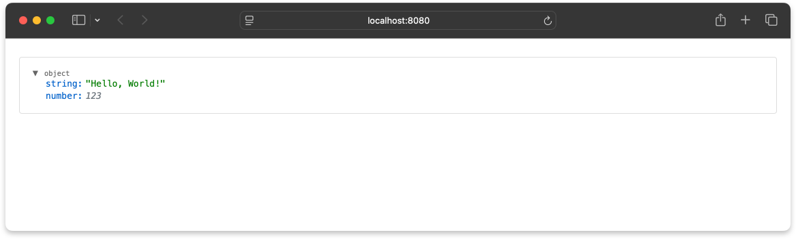
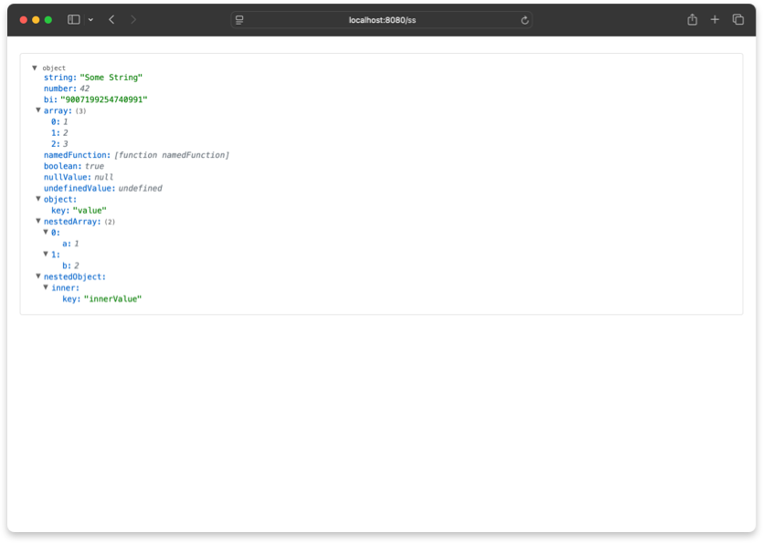
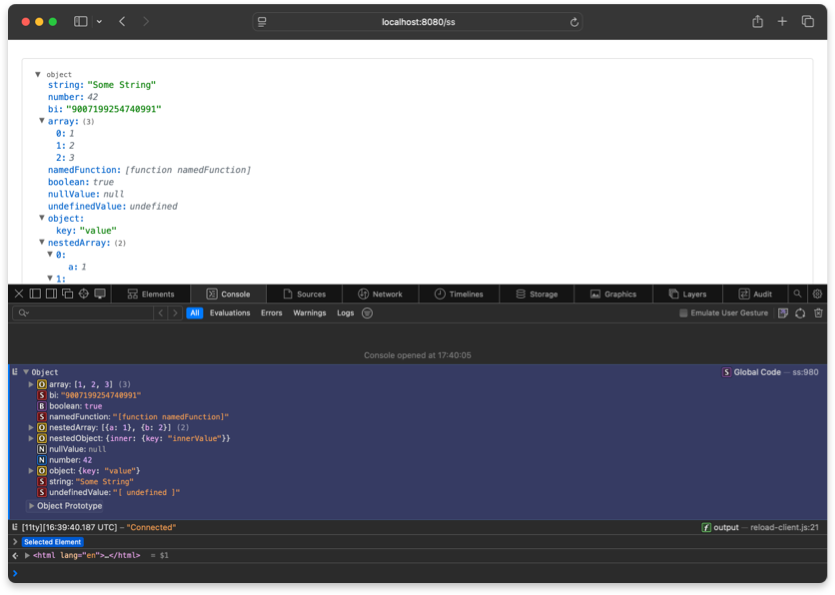
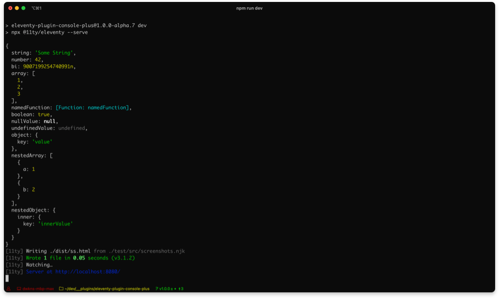

# eleventy-plugin-console-plus

**Console Plus** is a Eleventy (11ty) plugin that adds a shortcode for debugging your templates, objects, and data. It logs to your HTML output, your terminal, and your browser console—all at once, with beautiful formatting and deep customization.

If you've ever tried to debug collections or any other complex object in Eleventy this is for you. 

---

## ✨ Features

- Pretty-prints any value (object, array, string, etc.) in your template, terminal, and browser console
- Collapsible, interactive HTML viewer with type labels, key paths, and more
- Handles circular references, functions, symbols, BigInts, Dates, and undefined
- Hide or replace keys to reduce output complexity.
- Works with Eleventy v3+ (ESM & CJS)

---

## 🚀 Installation

```bash
npm install eleventy-plugin-console-plus
```

---

## ⚡ Quick Start

In your `eleventy.config.js` :

#### ES6

```js
import { consolePlus } from 'eleventy-plugin-console-plus';

export default function(eleventyConfig) {
  eleventyConfig.addPlugin(consolePlus);
}
```

#### CJS

```js
const { consolePlus } = require("eleventy-plugin-console-plus");

module.exports = async function(eleventyConfig) {
  eleventyConfig.addPlugin(consolePlus);
};
```


In your template:

```njk
  
```

Outputs to your HTML as:



---

## 🛠️ Usage

An object, string, variable or array is required as the first argument. A title and configurantion options are optional.

```

```

## Examples

Assume we have the following variable:

```js
 obj = {
        string: "Some String",
        number: 42,
        boolean: true,
        nullValue: null,
        undefinedValue: undefined,
        array: [1, 2, 3],
        object: { key: "value" },
        nestedArray: [{ a: 1 }, { b: 2 }],
        nestedObject: { inner: { key: "innerValue" } },
        template: { key1: "value1", key2: "value2", array: [1, 2, 3] }
 		}
```

### 1. **With a Title**

```njk

```


Show tpyes

default expanded 

### 2. **Showing Template Keys**

By default any key named `template` has it's value removed for performance reasons. Eleventy puts a TON of stuff in the `template` key of your page and in collections. You almost never need it. But if you do...
```njk

```


### 3. **Hiding or replacing keys**

Similarly sometimes your data contains a large nested structure that you're not interested in. You can exclude or replace this in the output with...

```njk

```


## ⚙️ Configuration

You can pass a configuration object when you add the plugin. 

In your `eleventy.config.js`:

```js
import consolePlus from 'eleventy-plugin-console-plus';

export default function(eleventyConfig) {
  eleventyConfig.addPlugin(consolePlus, { 
  	logToHtml: true,  				 // output to HTML
  	logToTerminal: false, 		 // output to terminal
  	logToBrowserConsole: false,// output to browser console
  	showTemplate: true         // always show template key
  } );
}
```
These options will apply to all instances of the shortcode. Unless you overide them on a case by case basis.

```html
	
```
`template` will not be shown and output will be logged to terminal  in this instance of the shortcode. 

You can see the full configurations options below. 

---

## ⚙️ Options Reference

| Option              | Type      | Default   | Description |
|---------------------|-----------|-----------|-------------|
| logToHtml           | boolean   | true      | Output to HTML viewer |
| logToTerminal       | boolean   | true      | Output to terminal |
| logToBrowserConsole | boolean   | true      | Output to browser console |
| title               | string    | ""        | Optional title for output |
| colorizeConsole     | boolean   | true      | Colorize terminal output |
| depth               | number    | 8         | Terminal object depth |
| breakLength         | number    | 60        | Terminal line break length |
| showTemplate        | boolean   | false     | Show 'template' keys in objects |
| maxCircularDepth    | number    | 1         | Max depth for circular references |
| removeKeys          | array     | []        | Keys to remove/replace (string or {keyName, replaceString}) |
| showTypes           | boolean   | false     | Show type labels in viewer |
| defaultExpanded     | boolean   | false     | Expand nodes by default in viewer |
| pathsOnHover        | boolean   | false     | Show key path hover panel in viewer |
| showControls        | boolean   | false     | Show UI controls in viewer |
| indentWidth         | number    | 6         | Indentation width in px in viewer |

---

## 🖼️ Screenshots

HTML output



Browser Console output



Terminal output



## Notable Updates
1.0.0  (latest) — Rewritten from scratch, improved HTML output, better plugin naming
0.1.1 Added logging to browser console & option to wrap line length.

## 📄 License

MIT 